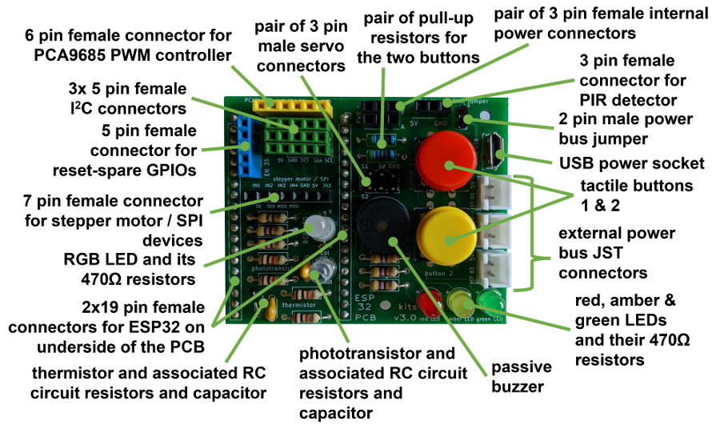
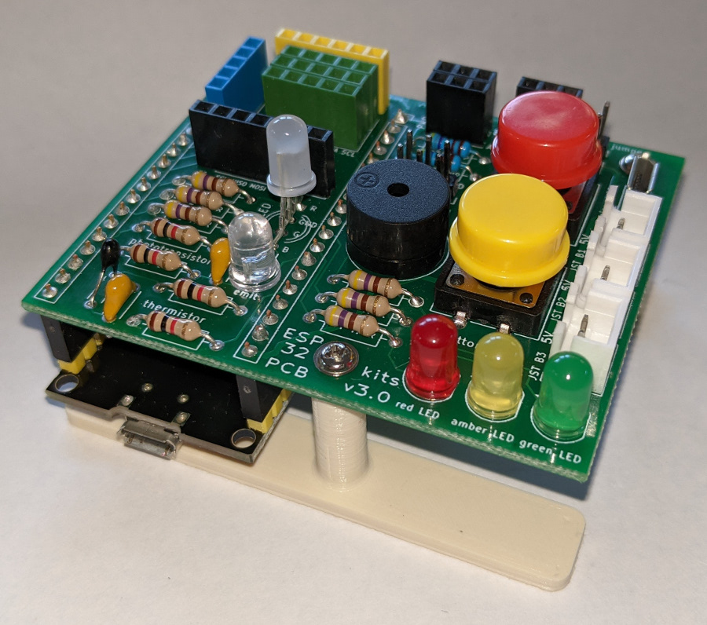
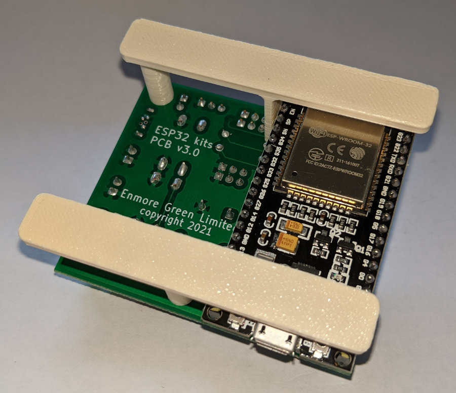

# ESP32 Maker Kit v3.0
## Documentation and example code for usage exploration of:
 - basic electronic functions
 - LCD, OLED and LED displays
 - servo, stepper and drive motor control
 - various sensors, and
 - web server set ups to control Kit connected items from a browser

  &nbsp; &nbsp; 

  A robust permanent assembly, that connects to the GPIO pins of a 38 pin ESP32 module, can be created by soldering a set of components into a custom Printed Circuit Board (PCB v3.0). The module design, as shown above, includes a number of on-board devices that can be controlled by the ESP32 (e.g. buzzer, LEDs, etc.), but also allows a wide range of further components to be connected to the PCB enabling more ESP32 controlled systems to be explored.

 &nbsp; &nbsp;  &nbsp; &nbsp;  

The custom PCB (now at v3.0) was designed using KiCAD and the Kit has been defined to provide all the components needed to build a fully populated module.

Full details about the project are published at <a href="https://onlinedevices.co.uk/ESP32+Maker+Kit" target="_blank" >this link</a> and the designs for a small number of associated custom 3D printed components will be available for download from the Prusa web site in due course.

All the example code was developed using the Arduino IDE and various standard/readily available libraries. Of particular note is the use of the TFT_eSPI library for use with SPI displays, where a Customs_Setup folder is provided which should be added to the display library folder along with a User_Setup_Select.h file, also added to the library folder, which provides the custom path references.
